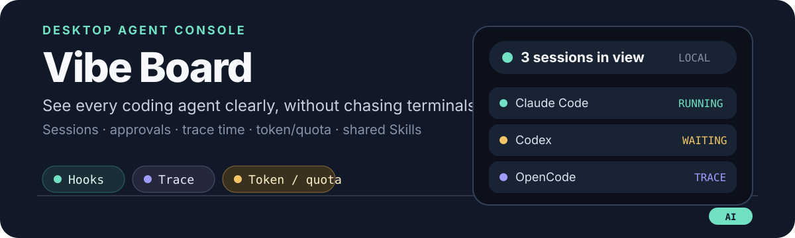

<div align="center">
  

  <p>
    <strong>A screen-edge task board for AI coding agents</strong><br />
    Vibe Board is a local-first Tauri desktop app that collects task status, approvals, and usage from Claude Code, Codex, Gemini CLI, OpenCode, Antigravity, and other agents into one board docked to the screen edge.
  </p>

  <p>
    <a href="./README.md">中文</a> ·
    <a href="./ROADMAP.md">Roadmap</a> ·
    <a href="./RELEASING.md">Releases</a> ·
    <a href="./UPSTREAM.md">Upstream &amp; license</a> ·
    <a href="./docs/privacy-policy.md">Privacy</a>
  </p>

  <p>
    
    
    
  </p>
</div>

## What it is

Vibe Board lives at the top or side edge of the screen. Expanding it shows the current task, agent online state, and usage. It solves three everyday problems:

- Several agents running at once stay distinguishable through conversation titles and execution states, without switching windows.
- Clicking a task jumps to its terminal; desktop agents open and foreground their app window.
- When token data is available it is shown directly; otherwise the UI shows provider quota and reset time. Online quota queries are off by default and only run for providers you authorize individually, using the credentials already stored locally for that provider.

The default look is solid black, with a frosted-glass effect available. The board docks to the top or either side edge, and the side dock has three sizes: 64×132 (narrow, default), 72×148 (standard), and 80×168 (wide).

## Windows install (x64, unsigned)

1. Download the latest package from [GitHub Releases](https://github.com/hyNous/agent-island/releases), or use the checked-in [Vibe Board-latest-setup.exe](./releases/Vibe%20Board-latest-setup.exe).
2. Install and launch Vibe Board. The first run opens the setup wizard: it scans the agents installed on the machine, then you pick the agents to connect and approve setup.
3. The wizard installs the selected hooks, saves startup options, and verifies the result; a failed check stays in the wizard with an error. Sessions of the connected agents then reach the board (starting the board on session start is off by default and enabled per agent).
4. To change the choice later, rerun **Settings → General → Agent connection**.

The installer is an unsigned Windows x64 build, so SmartScreen may ask for confirmation. Automatic updates are disabled; releases are downloaded manually from GitHub. The full first-run, permission, and migration notes are in [Product setup](docs/product-setup.md).

## What it can do

| Capability | Details |
| --- | --- |
| Task board | Shows the current task, agent online state, and completion reminders. The task area scrolls and shows only the agent, conversation title, and execution state — never conversation bodies. |
| Approvals and questions | Approve, deny, answer, or confirm plans during a run without returning to the terminal. |
| Usage | Prefers real tokens; otherwise shows provider quota, window, and reset time. Local session logs and local files need no authorization; online queries are off by default and require per-provider authorization on the Usage page, after which Vibe Board queries the provider with the credentials already stored locally (or through that provider's own CLI). Authorization can be revoked at any time. |
| Agent management | Scans CLIs and desktop apps for version, path, hook, and configuration state, and supports custom agents. |
| Skill management | Imports from an agent, local folder, or GitHub; adopts into the center library; distributes by symlink or copy. |
| Look and docking | Solid black by default with an optional frosted-glass effect; docks to the top or either side edge, with three side sizes. |

## Sync boundary

Hooks and local app-server events are the real-time path. A fallback poll runs every three seconds by default (adjustable from 1 to 30 seconds), and Codex also falls back to local rollout logs.

Coding agents do not expose one stable, universal task-lifecycle interface, so synchronization is best-effort and cannot guarantee that every running task is captured. Process scanning only confirms that an agent is online and is not used to create tasks. Vibe Board does not put session content through a hosted relay and collects no usage statistics: conversation bodies, tool details, and raw hook input never reach the board.

## Build from source

Requirements: Node.js 20+, pnpm, Rust/Cargo, and the Tauri CLI. Windows also needs Microsoft C++ Build Tools and WebView2.

```bash
git clone https://github.com/hyNous/agent-island.git
cd agent-island
pnpm install
pnpm tauri:dev
```

For browser-only UI work: `pnpm dev` (http://localhost:1423). Run the repository checks before submitting:

```bash
pnpm lint
pnpm test:run
pnpm build
cargo check --manifest-path src-tauri/Cargo.toml
```

## License and provenance

Vibe Board code is released under the [Apache License 2.0](./LICENSE), while the upstream [NOTICE](./NOTICE) and branding boundary in [TRADEMARKS.md](./TRADEMARKS.md) remain in the repository.

This is an independent modification based on [AgentBro](https://github.com/shirenchuang/agentbro): the product name, icons, and release configuration have been replaced, and this repository is not an official upstream distribution. See [UPSTREAM.md](./UPSTREAM.md) for details. Versioning, releases, and the roadmap are decided in this repository and do not follow the upstream release line — see [RELEASING.md](./RELEASING.md) and [ROADMAP.md](./ROADMAP.md). Issues and pull requests are welcome; read [CONTRIBUTING.md](./CONTRIBUTING.md) first.
